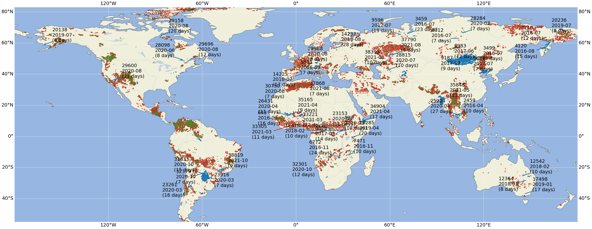
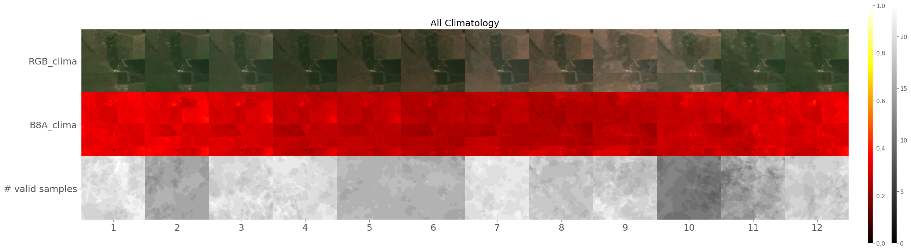
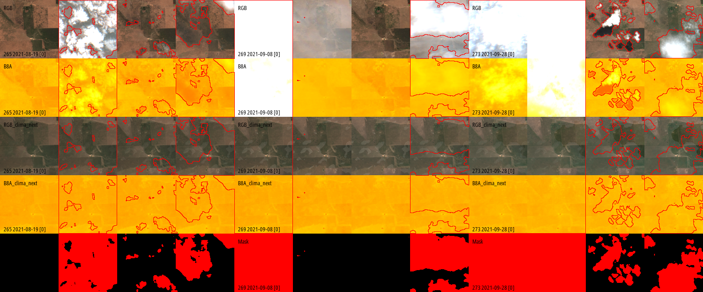
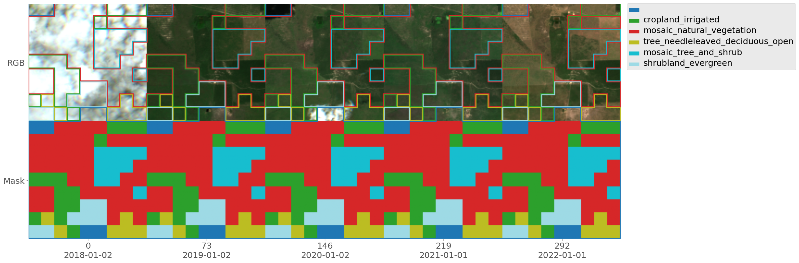
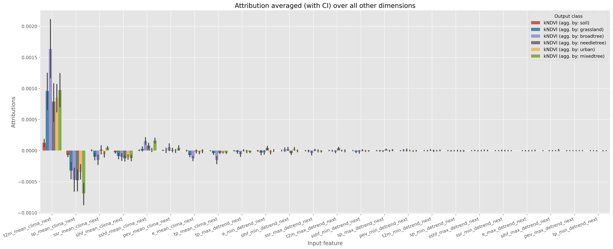
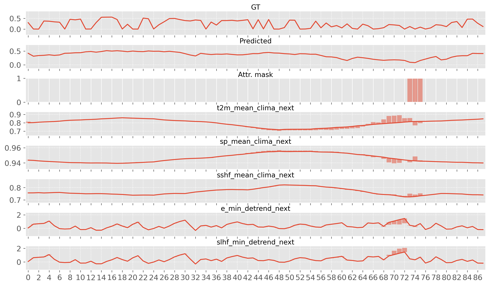

# txyXAI

EXplainable Artificial intelligence for spatio-temporal data. If you use any of this code, please reference the following paper:

>Paper under review

This repository contains code to:
 - Train deep learning models that use temporal data (t), spatial data (xy), spatio-temporal data (txy) or all at the same time (see [The EarthExtremes dataset](#the-earthextremes-dataset) for an example of such data).
 - Visualize high-dimensional spatio-temporal data through (all plots in section [The EarthExtremes dataset](#the-earthextremes-dataset) were generated using these tools). See [`txyvis` section](#txyvis)
 - Perform eXplainable AI (XAI) on highly-dimensional data (t, xy, txy) using a wide variety of options. See [`XAI.py` section](#xaipy)
 - Visualize the XAI results (for t, xy, txy) data and make sense of them at a local level (a single input), and global level (by combining predictions from several inputs in a variety of ways). See [`XAI_plot.py` section](#xai_plotpy)

It uses that code for a specific application:
 - To train a convLSTM on the [EarthExtremes dataset](#) that predicts reflectances at the new timestep.
 - Performs eXplainable AI (XAI) on this model.
 
See [Running the notebooks for EarthExtremes](#running-the-notebooks-for-earthextremes) section.
 
## The EarthExtremes dataset

The EarthExtremes dataset contains approx. 40.000 128px x 128px Sentinel-2 minicubes sampled from January 2016 (start of the Setinel-2 mission) until December 2022. For more information on this dataset, please refer to [paper under review](#).


>Map of the geographical distribution of the minicubes according to the subset to which they belong (red: train, green: validation, blue: test). Also, events with a duration of at least 10 days have been labeled on the map, along with their duration.

The dataset contains the following variables

### Sentinel-2 bands

Sentinel-2 bands at 30m: B2 (490 nm), B3 (560 nm), B4 (665 nm), B8 (842 nm), B5 (705 nm), B6 (740 nm), B7 (783 nm), B8a (865 nm), B11 (1610 nm), and B12 (2190 nm).

### ERA 5 Land variables

| Abbr. | Name | Units | Description | Reference |
|-----------|-----------|-------------|-----------|-----------|
| e | Evaporation | m of water equivalent | Accumulated amount of water that has evaporated from the Earth's surface. Negative values indicate evaporation, positive condensation | [link](https://apps.ecmwf.int/codes/grib/param-db?id=182) |
| pev | Potential evaporation | m  | Indication of the maximum possible evaporation | [link](https://apps.ecmwf.int/codes/grib/param-db?id=228251) |
| slhf | Surface latent heat flux | J/m^2 | Transfer of latent heat (resulting from water phase changes, such as evaporation or condensation) between the Earth's surface and the atmosphere through turbulent air motion. Vertical flux is positive downwards | [link](https://apps.ecmwf.int/codes/grib/param-db?id=147) |
| sp | Surface pressure | Pa | Weight of all the air in a column vertically above the area of the Earth's surface represented at a fixed point | [link](https://apps.ecmwf.int/codes/grib/param-db?id=134) |
| sshf | Surface sensible heat flux | J/m^2 | Transfer of heat between the Earth's surface and the atmosphere through turbulent air motion, excluding any heat transfer resulting from condensation or evaporation | [link](https://apps.ecmwf.int/codes/grib/param-db?id=146) |
| ssr | Surface net short-wave (solar) radiation | J/m^2 | Amount of solar radiation (aka shortwave radiation) that reaches a horizontal plane at the surface of the Earth (both direct and diffuse) minus the amount reflected by the surface (governed by the albedo) | [link](https://apps.ecmwf.int/codes/grib/param-db?id=176) |
| t2m | Temperature (at 2m) | K | Temperature in the atmosphere | [link](https://apps.ecmwf.int/codes/grib/param-db?id=130) |
| tp | Total precipitation | m | Accumulated liquid and frozen water, comprising rain and snow, that falls to the Earth's surface. It is the sum of large-scale precipitation and convective precipitation | [link](https://codes.ecmwf.int/grib/param-db/?id=228) |

Source: https://confluence.ecmwf.int/display/CKB/ERA5%3A+data+documentation

### Others

Other variables include:
 - A dynamic cloud mask, classes: cloud, a cloud shadow, snow, and masked for other reasons).
 - The [LCCS vegetation-focused static land cover](https://www.fao.org/3/x0596e/x0596e01f.htm), with a total of 34 different classes at 240m x 240m resolution.
 - The [Copernicus Depth Elevation Model (DEM)](https://spacedata.copernicus.eu/collections/copernicus-digital-elevation-model), with 30m x 30m resolution.

## Repository organization

- `/experiments` contains all the artifacts generated from running an experiment.
  - `2024_04_base` base model with the main reported results
    - `xai` plots generated for that experiment by the XAI library
    - `train_plots` plots of the model prediction's generated during training
    - `test_plots` plots of the model prediction's generated during testing / validation
    - `checkpoints` weights of the model
    - `training_logs`
      - `version_N`
        - `hparams.yaml` a dictionary with all the hyperparameters and configurations for the experiment
        - `events[...].0` tensorboard file with training logs 
- `/lib` contains the actual library files, to be used by the notebooks or standalone
  - `XAI.py`: Main class and entry point for handling eXplainable XAI experiments. It calls other functions for attribution (from `XAI_attribute.py`) and for plotting (from `XAI_plot.py`)
  - `XAI_attribute.py`: Code for performing attribution
  - `XAI_plot.py`: Code for plotting attributions for 1D, 2D (using 3D plot), 3D, and N-D data
  - `XAI_utils.py`: Utilities
  - `XAI_deepextremes_loader.py`: Custom dataset for EarthExtremes to feed `XAI.py` the data that it needs to peform XAI. It is an absract class as some information is left by the user to be implemented depeding on their model (e.g. the model in this repo or the model in  [`earthnet_models_pytorch`](https://github.com/earthnet2021/earthnet-models-pytorch/tree/melanie-de)
  - `model_manager.py`: Contains class `ModelManager` for managing the training and evaluation of general pytorch lightning models
  - `model_xytmodel.py`: Contains abstract class `xytModel` implementing a pytorch lightning model for dealing with spatio-temporal data. It can be especialized by any suitable backend, such as `xytConvLSTM` and `xytConvTransformer`. This file also contains custom metrics and losses
  - `model_convLSTM.py`: convLSTM generic model
  - `model_transformer.py`: transformer generic model
  - `data_loader.py`: A dataloader for EarthExtremes dataset, but defined in a generic way to be easily adaptable to other spatio-temporal problems
  - `data_utils.py`: A collection of utilities for handling data
  - `aggregateevents.py`: Custom script to aggregate the events in the EarthExtremes dataset (a custom preprocessing step)
- `/subsets` contains additional metadata about the EarthExtremes dataset
  - `bad_cubes_final.txt`: EarthExtremes Cube IDs with problems (either no ERA5 data, no Sentinel2, empty, or other reasons)
  - `demc_full_10groups_50km.csv` File containing the splits for K-fold cross validation of the model 
- `training.ipynb` training and validation for a txyXAI model trained on EarthExtremes
- `xai.ipynb` performs a variety of XAI tasks on that model
- `xai_emp.ipynb` performs a variety of XAI tasks on a model trained on EarthExtremes using [`earthnet_models_pytorch`](https://github.com/earthnet2021/earthnet-models-pytorch/tree/melanie-de) instead. This serves as an example of how you could adapt the XAI to your own model.
- `utils.ipynb` contains code for plotting [a map](#the-earthextremes-dataset) with all the minicubes in the EarhtExtremes dataset, for creating lists of bad cubes (either no ERA5 data, no Sentinel2, empty, or other reasons), etc.

## Installation instructions

Download and install [mamba](https://mamba.readthedocs.io/en/latest/installation/mamba-installation.html) (or just use Anaconda / Miniconda, but mamba is much better)

Now, yout can try to install the fixed-version packages using conda / mamba.

```{Bash}
mamba env create -f env.yaml -n txyxai
mamba activate txyxai

git clone https://github.com/DeepExtremes/txyXAI
cd txyXAI

pip install git+https://github.com/OscarPellicer/txyvis.git
```

If that does not work, or you want to use the latest versions of all packages:

```{Bash}
#Create env
mamba create -n txyxai python=3.10
mamba activate txyxai

#Install requireremnts
mamba install numpy matplotlib pandas ipython ipykernel jupyterlab xarray seaborn dask cartopy scikit-learn

#Pytorch
mamba install pytorch torchvision pytorch-cuda captum torchmetrics pytorch-lightning -c pytorch -c nvidia 

#Others
pip install lovely-tensors opencv-python textalloc zarr
pip install git+https://github.com/OscarPellicer/txyvis.git
```

## Running the notebooks for EarthExtremes

First, lunch Jupyter Lab:
```{Bash}
jupyter lab
```

There are three notebooks that we can run, which are well-documented all througout:

- [`training.ipynb`](training.ipynb) training and validation for a txyXAI model trained on EarthExtremes.
- [`xai.ipynb`](xai.ipynb) performs a variety of XAI tasks on that model.
- [`xai_emp.ipynb`](xai_emp.ipynb) performs a variety of XAI tasks on a model trained on EarthExtremes using [`earthnet_models_pytorch`](https://github.com/earthnet2021/earthnet-models-pytorch/tree/melanie-de) instead. This serves as an example of how you could adapt the XAI to your own model.
- [`utils.ipynb`](utils.ipynb) contains code for plotting [a map](#the-earthextremes-dataset) with all the minicubes in the EarhtExtremes dataset, for creating lists of bad cubes (either no ERA5 data, no Sentinel2, empty, or other reasons), etc.
 
For `xai_emp.ipynb`, we need to create another environment with the `earthnet_models_pytorch` requirements dependencies + some dependencies for the XAI code:
```
#Create emp environment
mamba create -n emp
mamba activate emp

#Install earthnet_models_pytorch's appropriate branch
pip install git+https://github.com/earthnet2021/earthnet-models-pytorch/tree/melanie-de.git

#Install requirements for running this notebook
pip install lovely-tensors opencv-python
mamba install captum
pip install git+https://github.com/OscarPellicer/txyvis.git
```

Addtionally, you will need a model checkpoint (you set the path in the notebook's variable `checkpoint_path`), as well as the EartheExtremes collection, but interpolated in the context period, which can be obtained from a standard EarthExtremes distribution by running `earthnet-models-pytorch`'s `scripts/preprocessing/de23_add_interpolation.py` on the datasest. Please, contact `earthnet-models-pytorch`'s library creators for more information in these regards.

## `txyvis`

Custom visualization of highly-dimensional data (specially multichannel spatio-temporal) with matplotlib and numpy backends. This code now lives in its own [txyvis repository](https://github.com/OscarPellicer/txyvis)

To install:

```{Bash}
pip install git+https://github.com/OscarPellicer/txyvis.git
```

Here are some example plots:

We can have an arbitrary number of color bars (for different channels), that have esily customizable `limits`, that can be `center`ed around zero or not, and with custom `cmaps`, allowing for the easy visualization of several image modalities / bands / channels. If images are have three channels (they either have 1 or 3), then they are assumed to be RGB. The example below uses two different color bars:


If you ever got the Matplitlib error: `ValueError: Image size of NxM pixels is too large. It must be less than 2^16 in each direction`, then you know that Matplotib cannot plot bigger images. For those cases, there is the `numpy backend` which uses no Matplotlib to build the image, and returns an RGB image array for direct plotting, saving, or sending to TensorBoard. The example below uses the `numpy backend`:


Finally, the library supports plotting masks with an arbitrary number of classes (int-encoded), either on top of the image, or as an independent image at the bottom, or both at the same time. In this example we are plotting the mask both on top of the data as well as at the bottom for clarity:


This is one last example of a very big image where `stack_every` was set to 73, so that rows are stacked vertically every approximately one year of data, allowing to better see inter-year changes to vegetation:


Here are some notable functions in this file:

### `plot_maps` function signature:

Plots highly dimensional image-like data alongside masks, etc. Supports matplotlib as well as direct generation of images without matplotib.

```{Python}
def plot_maps(
    images:list, #Image with shape (t, {1,3}, h, w) 
    cmaps:Optional[list]=None, #List of mpl cmaps. E.g: ['PiYG', 'hot']
    centers:Optional[list]=None, #List of bools defining whether to force the colorbar to be centered
    limits:Optional[list]=None, #List of tuples of two floats, defining the limits of the colorbar
    title:Optional[str]=None, #Title of the plot
    masks:Optional[list]=None, #List of masks with shape (t, 1, h, w) 
    figsize:Union[tuple, float]=1., #Tuple of two ints or float (scale of the auto figsize)
    xlabels:Optional[list]=None, #List of x labels
    ylabels:Optional[list]=None, #List of y labels
    classes:Optional[dict]=None, #Legend of the classes in masks
    colorbar_position='vertical', #One of ['horizontal', 'vertical']
    mask_kwargs:dict={}, #Args to pass to `add_mask`, such as `colors`
    cmap_kwargs:dict=dict(  #Args to pass to `nan_color` and `inf_color`
      nan_color='cyan', #Color nan pixels 
      inf_color='orangered', #Color inf pixels 
      zero_color='magenta'), #Color for allzero images
    upscale_factor:int=1, #Upscale image and mask to reduce border width
    show:bool=True,
    backend:str='matplotlib', #If backend is numpy, create image only through array manipulation
    numpy_backend_kwargs:dict={'size':12, 'color':'black', 
                             'xstep':1, 'ystep':1, #Plot labels every n steps
                             'labels':'edges', #Plot either on 'edges' or full 'grid'
                             'font':'OpenSans_Condensed-Regular.ttf'},
    plot_mask_channel=None, #Plot the mask corresponding to image at position plot_mask_channel
    matplotlib_backend_kwargs:dict={'text_size':None},
    transpose:bool=False, #If true, time is set along the y axis (by default, it is along the x-xis)
    stack_every:Union[int,bool]= False #If True, stack the image vertically every `stack_every` images
 ):
    ''' 
    Images must have shape (t, {1,3}, h, w) 
    If image is already rgb, the parameters associated to that image except `limits` will be ignored
    If `backend == `matplotlib`, returns (fig, axes)
    If `backend == `numpy`, returns image array
    '''
```

### `add_mask` function signature:

Embeds a mask into an image either by blending mask color and image color, or by painting only the border of the mask over the image.

```{Python}
def add_mask(img:np.ndarray, mask:np.ndarray, colors:dict={0:None, 1:'r'}, 
             mode:Union[str,float]='border'):
    '''
    Superimpose a `mask` over an image `img` using some blending `mode` and
    specific `colors` for every class in `mask`. It expects:
        - mask: (w,h,1)
        - image: (w,h,3)
    '''
```

## `XAI.py`

This contains the class for handling eXplainable AI (XAI) experiments. It explains the predictions of the deep learning models by using any attribution method from `captum.attr` such as `Saliency`, `InputXGradient`, or `IntegratedGradients`. It should work for all kinds of output data (categorical / regresion) and all kinds of input / output dimensionality, providing attribution plots for all possibilities using [`XAI_plot.py`](#xai-plotpy). It also supports aggregation of the inputs (e.g. by mean, or absolute maximum value) over specific dimensions, and aggregation of the outputs based on a mask (e.g.: consider only predictions that have low error, consider only predicitions given a certain ground truth class, or based on a custom compartmentalization).

It uses `XAI_attribute.py`'s `attribute` method to perform the attribution, which is standalone. Internally, it builds a Pytorch `nn.Module` (`XAIModelWrapper`) that, provided an attribution mask, it uses this mask to aggregate over the classes, either by simple direct masking if `cross_agg=False` where the mask just selects some wanted pixels from each output class, or by generating all possible combinations of the output classes with the masking classes if `cross_agg=True`. In this last case, the new number of classes for attribution is the product of original_classes x aggregation_classes. Selected samples are then aggreated using `agg_mask_fn` (e.g., `torch.mean`). 

In summary, this code provides an easy way to attribute over specific outputs values, which is very useful for highly-dimensional outputs, and it is not straightforward to do with base Captum.

## `XAI_plot.py`

Plotting of attribution maps for 1D, 2D and 3D inputs (+ channel dimension). A general plot (ND) showing average overall attributions of input features vs output features is always available for data of any dimensionality. Here are the most relevant functions along with some example plots:

### `plot_attributions_nd` function signature:



```{Python}
def plot_attributions_nd(data:np.ndarray, x_shape:List[int], y_shape:List[int], 
                         feature_names:List[str], class_names:List[str], figsize:Tuple[float]=(17,9),
                         max_values:Optional[int]=1e6, orientation:str='h', plot_first_N:int=100, 
                         textwrap_width:Optional[int]=None,
                         ) -> Tuple[mpl.figure.Figure, plt.axis]:
    '''
        Plots avarage attributions over all dimensions except for output classes and input features
        It should work for any kind of model and input / output dimensionality
        
        :param data: attributions array with shape ([out x, out y, out t], out classes, [in x, in y, in t], in features)
        :param x_shape: List [[in x, in y, in t], in features]
        :param y_shape: List [[out x, out y, out t], out classes]
        :param feature_names: List with the names of the in features
        :param class_names: List with the names of the output classes
        :param figsize: figsize to pass to plt.subplots
        :param max_values: maximum number of attribution values to consider (to speed up plotting)
        :param orientation: plot orientation, either 'h' (default) or 'v'
        :param plot_first_N: int, limit the plot to the first N most relevant features
        :param textwrap_width: int, if not None, force-wrap the label's text if longer than textwrap_width chars
        
        :return: Matplotlib figure and ax
    '''
```

### `plot_attributions_1d` function signature:



```{Python}
def plot_attributions_1d(attributions:np.ndarray, #(out classes, in t, in features)
                         inputs:np.ndarray, #(in t, in features)
                         labels:np.ndarray, #(out t, [out classes]) out classes is optional
                         predictions:np.ndarray, #(out t, out classes)
                         masks:np.ndarray, #(out_t, out_classes)
                         feature_names:List[str], #List of in features names
                         class_names:List[str], #List of out classes names
                         plot_classes_predictions:Optional[List[str]]=None, 
                         #Classes to plot for predictions. If None, first class is ignored
                         plot_classes_attributions:Optional[List[str]]=None, 
                         #Classes to plot for attributions. If None, first class is ignored
                         figsize:Tuple[float]=(10,10), #Matplotlib figsize
                         #out t wrt which attributions are plotted. If None, use out t where first event occurs
                         color_list=list(mpl.colors.TABLEAU_COLORS),
                         title:Optional[str]=None,
                         margin_perc:float=25., #Add some % of margin to feature plots
                         alpha:float=0.8, 
                         attr_factor:float=0.5,
                         attr_baseline:str='middle', #One of {'middle', 'feature'}
                         kind:str='stacked', #One of {'stacked', 'sidebyside'}
                         names_position:str='left', #One of {'left', 'top'}
                         label_fontsize:float=11,
                         is_classification:bool=True,
                         **kwargs) -> Tuple[mpl.figure.Figure, plt.axis]:
    '''
    Plot 1D attributions (e.g. of a inputs) given an output timestep.
    If you want to see absolute attributions, pass np.abs(attributions) instead.
    
    :param attributions: array with shape (out classes, in t, in features)
    :param inputs: array with shape (in t, in features)
    :param labels: array with shape (out t, [out classes]) out classes is optional
    :param predictions: array with shape (out t, out classes)
    :param masks: array with shape (out t, out classes)
    :param feature_names: List of in features names
    :param class_names: List of out classes names
    :param plot_classes_predictions: Classes to plot for predictions. If None, first class is ignored 
        if there are more than 2 classes
    :param plot_classes_attributions: Classes to plot for attributions. If None, first class is ignored 
        if there are more than 2 classes
    :param figsize: Matplotlib figsize
    :param timesteps: Global x values
    :param timestep: output timestep with respect to which which attributions are plotted. 
        If None, use the first timestep where the ground truth output class != 0
    :param color_list: list of Matplotlib-compatible colors
    :param title: title of the plot
    :param margin_perc: Add some % of margin to feature plots
    :param alpha: transparency of the bars
    :param attr_factor: mutiply attribution values by this number (e.g., if 0.5, the attribution can only
        take maximum 50% of the height of the plot. Recommended: 0.5 for signed attributions, and 1
        for absolute attributions (this is done by default)
    :param attr_baseline: Where to place the attribution bars with respect to the plot.
        attr_baseline='middle': start attribution bars from the middle of the plot
        attr_baseline='feature': start attribution bars from the feature value for that timestep
    :param kind: How to plot attributions: 
        kind='stacked': plot attributions for each class stacked on top of each other
        kind='sidebyside': plot attributions for each class side by side
    :param names_position: Where to position the names of the features
        names_position='left': position them to the left of the plot
        names_position='top': position them to the top of the plot
    :param label_fontsize: font size of the labels
    :param is_classification: whether it is a classification or a regression problem
    
    :param *kwargs: kwargs to be passed to plt.subplots
    
    :return: Matplotlib figure and ax
    '''   
```

### `plot_attributions_3d` function signature:


```{Python}
def plot_attributions_3d(attributions:np.ndarray, inputs:np.ndarray, labels:np.ndarray, 
                         predictions:np.ndarray, masks:np.ndarray, 
                         feature_names:List[str], class_names:List[str], #outlier_perc:float=0.1,
                         save_path:Optional[Union[Path,str]]=None, title:str='', backend:str='numpy',
                         in_channels_rgb:List[str]=['B04', 'B03', 'B02'], 
                         out_channels_rgb:List[str]=['B04', 'B03', 'B02'], transpose=False,
                         xlabels=None):
    '''
    Plots attributions of 3D data alongside the data, i.e (x y t c) or (x y z c), and attributions (co x y t ci)
    
    :param attributions: array with shape (out classes, in x, in y, in t / in z, in features)
    :param inputs: array with shape (in x, in y, in t / in z, in features)
    :param labels: array with shape (out x, out y, out t / out z, out classes)
    :param predictions: array with shape (out x, out y, out t / out z, out classes)
    :param masks: binary array with shape (out x, out y, out t / out z, out classes)
    :param feature_names: List of in features names
    :param class_names: List of out classes names
    :param save_path: Path of the output image, or None to not save anything
    :param title: Title of the figure (to be ignored if backend is numpy)
    :param backend: `numpy` or `matplotlib`. See more info in `plot_maps`
    :param in_channels_rgb: List of three input features corresponding to RGB channels. They will be aggregated and plotted together
    :param out_channels_rgb: List of three output classes corresponding to RGB channels. They will be aggregated and plotted together
        Also, the corresponding attributions will be averaged over the RGB channels for plotting.
        
    :return: Matplotlib figure and ax if backend == `matplotlib` or RGB image array, if backend == `numpy`
    '''
```